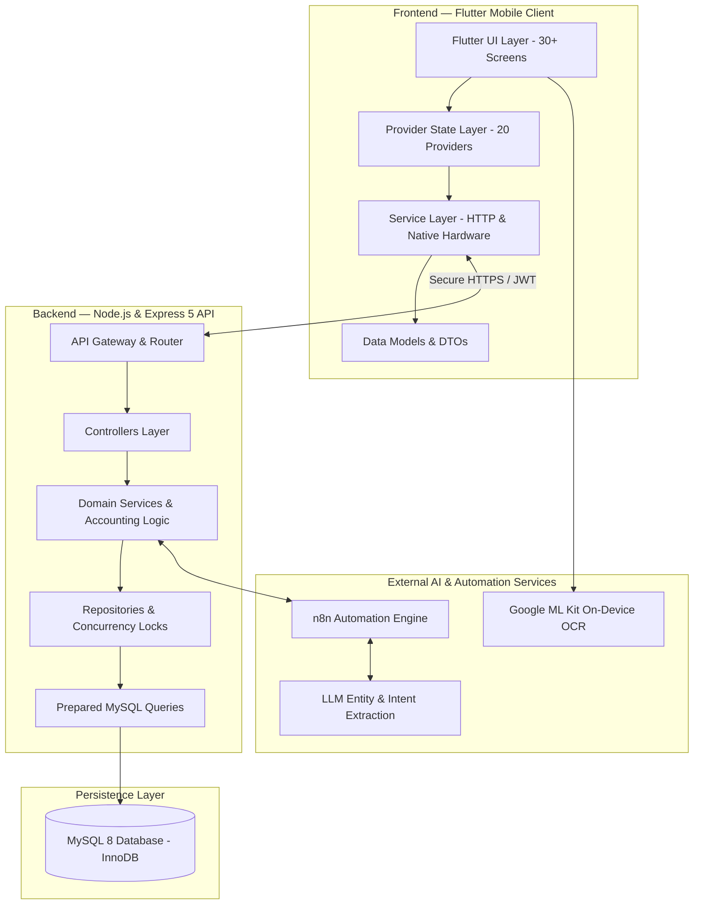
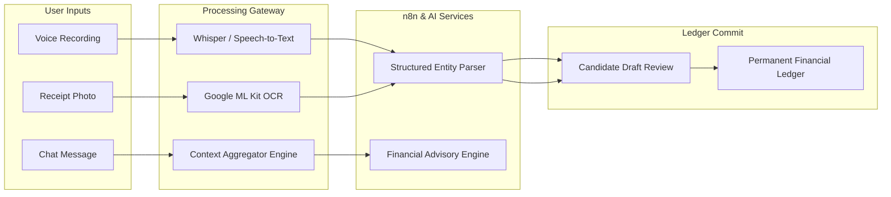
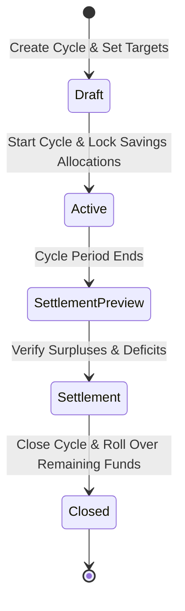

<div align="center">


# AlphaAPP (ألفا)
### Smart AI-Powered Personal Finance & Budgeting Platform

[](https://flutter.dev)
[](https://dart.dev)
[](https://nodejs.org)
[](https://expressjs.com)
[](https://www.mysql.com)
[](https://n8n.io)
[](https://vitest.dev)
[](#-license--authors)

<p align="center">
  <b>A comprehensive, enterprise-grade financial management platform combining automated monthly cycles, atomic concurrency-safe ledgers, on-device OCR receipt scanning, and context-aware multi-modal AI voice & chat assistance.</b>
</p>

[Key Features](#-key-features) • [Architecture](#-system-architecture) • [App Pillars](#-core-app-pillars) • [Database & Migrations](#-database-architecture--migrations) • [API Specs](#-api-architecture--security) • [Getting Started](#-getting-started)

</div>

---

## 📸 Core App Pillars

<div align="center">
<table>
  <tr>
    <td align="center" width="33%">
      <br />
      <b>AI Financial Brain</b><br />
      <sub>Context-aware voice & chat assistance with n8n workflow pipelines.</sub>
    </td>
    <td align="center" width="33%">
      <br />
      <b>Smart Cycles & 50/30/20</b><br />
      <sub>Automated monthly budgeting with Safe Daily Spending calculations.</sub>
    </td>
    <td align="center" width="33%">
      <br />
      <b>Goal Ledgers & Safety</b><br />
      <sub>Protected emergency funds, permanent audit trails, and zero double-counting.</sub>
    </td>
  </tr>
</table>
</div>

---

## 🌟 Executive Summary

**AlphaAPP** is a full-stack personal finance platform engineered to address the core challenges of personal wealth management, specifically tailored for the Arab and Jordanian markets (native **JOD** currency support and bidirectional Arabic RTL / English LTR design).

### Problem vs. Solution Matrix

| The Real-World Challenge | The AlphaAPP Solution |
|---|---|
| **High Friction in Manual Logging** | Multi-modal entry: Speech-to-Text, Camera Receipt OCR (`Google ML Kit`), and fast manual tagging. |
| **Budget Depletion Before Payday** | Dynamic **Safe Daily Spending (SDS)** metric continuously recalibrates discretionary allowances. |
| **Unstructured Savings & Leakage** | Automated **Canonical Savings Allocation** guaranteeing zero double-counting across goals and emergency funds. |
| **Lack of Actionable Insights** | Real-time **Financial Analysis Center** with interactive charts (`fl_chart`) and predictive health scoring. |
| **Financial Disengagement** | Gamified challenges (daily, weekly, monthly), achievement points, badges, and a community leaderboard. |

---

## 🏗️ System Architecture

AlphaAPP follows a decoupled, highly scalable **Client-Server Architecture** with strict layer boundaries.

### High-Level Architectural Flow



### AI Pipeline & Multi-Modal Processing



---

## ⚡ Key Features

### 1. 🤖 Context-Aware AI Assistant & Voice Engine
- **Full Context Understanding**: The AI chatbot has access to current cycle health, active goals, recent expenses, and spending velocity.
- **Voice-to-Expense**: Record a quick voice note (e.g., *"Paid 15 dinars for fuel with my Visa card"*), and the engine extracts `amount: 15`, `currency: JOD`, `category: transport`, and `paymentMethod: card`.
- **Smart Rate Limiting**: Built-in protection limiting chat queries to 10 requests/minute to prevent API exhaustion.

### 2. 🧾 Smart Receipt Scanner (OCR)
- **On-Device Vision**: Extracts raw text from supermarket, restaurant, and pharmacy invoices using `google_mlkit_text_recognition`.
- **Intelligent Normalizer**: Automatically infers tax, discounts, date, merchant name, and total amount.
- **Human-in-the-Loop Review**: All parsed receipts open a **Draft Review Screen** before committing to the database.

### 3. 📊 Financial Cycles & The 50/30/20 Rule
- **Dynamic Payday Alignment**: Instead of rigid calendar months, users define custom cycle start dates (e.g., the 25th of every month).
- **Three-Bucket Separation**:
  - **Needs**: Fixed commitments, rent, bills, groceries.
  - **Wants**: Entertainment, shopping, personal hobbies.
  - **Savings**: Emergency reserves and capital goals.
- **Safe Daily Spending (SDS)**:
  $$\text{Safe Daily Spending} = \frac{\text{Remaining Unallocated Discretionary Budget}}{\text{Remaining Days in Current Cycle}}$$

### 4. 🎯 Financial Goals & Canonical Accounting
- **Row-Level Locking (`SELECT ... FOR UPDATE`)**: Eliminates race conditions across multiple devices.
- **Permanent Audit Trail**: Every contribution is an immutable ledger entry.
- **Zero Double-Counting Invariant**:
  $$\text{Unallocated Savings} = \text{Planned Savings} - \text{Emergency Fund} - \sum \text{Goal Allocations}$$



### 5. 🏆 Gamification, Challenges & Social Motivation
- **Savings Challenges**: Zero-spend days, dining-out detox, and sprint challenges.
- **Points & Badges**: Earn achievements for staying within budget and logging consistently.
- **Leaderboard**: Anonymized rankings encouraging peer accountability.
- **Delightful Micro-Interactions**: Custom in-app rating prompt and birthday celebration dialogs.

---

## 🛠️ Technology Stack

### Mobile Client (Flutter)
| Technology | Version | Role in Project |
|---|---|---|
| **Flutter SDK** | `>= 3.0.0` | High-performance multi-platform UI framework |
| **Dart** | `>= 3.0.0` | Strongly-typed client language |
| **Provider** | `^6.1.5` | Reactive state management and service dependency injection |
| **Easy Localization** | `^3.0.8` | Complete bilingual i18n (Arabic RTL / English LTR) |
| **Google ML Kit** | `^0.16.0` | On-device machine learning OCR for receipts |
| **FL Chart** | `^1.2.0` | Smooth, interactive analytics and budget visualizers |
| **Record & Just Audio** | `^7.1.1` / `^0.10.6` | High-fidelity voice note recording & audio playback |
| **Google Fonts** | `^8.2.0` | Custom typography designed for the Mariam UI aesthetic |

### Backend API (Node.js)
| Technology | Version | Role in Project |
|---|---|---|
| **Node.js** | `>= 18.x` | Asynchronous event-driven runtime |
| **Express.js** | `5.2.1` | High-throughput web routing framework |
| **MySQL 2** | `^3.23.1` | Relational persistence with ACID transactions |
| **JSONWebToken** | `^9.0.3` | Cryptographically signed stateless bearer authentication |
| **Bcrypt** | `^6.0.0` | Salted password hashing (cost factor 10) |
| **Helmet** | `^8.3.0` | HTTP security headers (CSP, HSTS, XSS protection) |
| **Express Rate Limit** | `^8.6.0` | IP-based request throttler |
| **Vitest** | `^4.1.10` | High-speed unit & integration test runner |

---

## 🗄️ Database Architecture & Migrations

The database schema is strictly managed via 26 sequential migration scripts, enforcing referential integrity and foreign key cascades.

<details>
<summary><b>🔍 Click to expand the full 26-step database migration log</b></summary>
<br />

| Migration # | Name | Core Functional Objective |
|:---:|---|---|
| **001–004** | `initial_schema_and_users` | Core user identity, baseline transactions, and profile schema |
| **005** | `add_detected_tier_to_profiles` | Algorithmic financial tiering based on income brackets |
| **006** | `convert_cents_to_jod` | Precision conversion from cents to Jordanian Dinar (JOD) |
| **007** | `add_multi_input_support` | Tracking transaction origins (Manual, Voice AI, Receipt OCR) |
| **008** | `add_payment_method` | Support for Cash, Credit/Debit Card, and Mobile Wallets |
| **009** | `phase1_goal_ledger` | Permanent audit ledger for immutable goal contributions |
| **010** | `post_deployment_goal_ledger_fks`| Strict foreign key enforcement across ledger tables |
| **011** | `phase2_goal_planning` | Goal planning modes, preview APIs, and target calculations |
| **012** | `phase2c_savings_allocations` | Savings distribution tables and automated allocation |
| **013** | `add_personal_info_columns` | Extended profile demographics, occupation, and birthday |
| **014** | `phase3a_financial_cycles` | Foundational table for user cycle lifecycle states |
| **015** | `phase3a2_cycle_activity` | Event logging for transaction events per cycle |
| **016** | `phase3a3_cycle_planning` | Budgeting schema for cycle bucket distribution |
| **017** | `phase3b_settlement` | Schema for closing cycles and carrying forward balances |
| **018** | `chat_ai_tables` | Persistent sessions and messages for AI chat interactions |
| **019** | `chat_indexes` | Performance indices for rapid conversational history retrieval |
| **020** | `reconcile_cycle_settlements` | Reconciliation constraints and data consistency fixes |
| **021** | `add_system_managed_goal_identity` | System-managed goals identity (Emergency Fund as managed goal) |
| **022** | `financial_analysis_history` | Historical archive for comprehensive financial health audits |
| **023** | `add_notifications` | User notification delivery and read status management |
| **024** | `challenges_system` | Gamification tables (challenges, user participations, points) |
| **025** | `fix_challenge_constraints` | Refined challenge participation uniqueness constraints |
| **026** | `canonical_savings_accounting` | Canonical savings accounting enforcing zero double-counting |

</details>

---

## 🧭 State Management Architecture

The Flutter client organizes state into **20 dedicated Providers**, ensuring high performance, zero memory leaks, and clear separation of concerns.

| Category | Provider Names | Responsibility |
|---|---|---|
| **Authentication & Profile** | `AuthProvider`, `OnboardingProvider`, `ProfileProvider`, `PersonalProvider` | User credentials, session persistence, onboarding flow, and user profile data. |
| **Core Financial Engines** | `CycleProvider`, `FinancialProvider`, `FinancialSetupProvider`, `FinancialProfileProvider` | Active cycles, budget buckets, safe daily spending, and recurring commitments. |
| **Operations & Transactions** | `ExpenseProvider`, `IncomeProvider`, `GoalProvider`, `ReceiptProvider` | CRUD operations for income/expenses, goal ledgers, and camera receipt processing. |
| **Intelligence & Insights** | `ChatbotProvider`, `FinancialAnalysisProvider`, `NotificationProvider` | AI conversational state, health score calculation, and system notifications. |
| **Gamification** | `ChallengeProvider`, `LeaderboardProvider`, `RewardProvider` | Savings challenges, point totals, and community standings. |
| **App Settings** | `ThemeProvider`, `LanguageProvider`, `HomeProvider` | Light/Dark mode toggling, Arabic/English i18n, and dashboard view aggregations. |

---

## 🌐 API Architecture & Security

### Key API Domain Endpoints

<details>
<summary><b>🔍 Click to expand the API endpoints overview</b></summary>
<br />

| Domain | Base Path | Methods | Description |
|---|---|:---:|---|
| **Auth** | `/api/v1/auth` | `POST` | `/login`, `/register`, `/verify-otp`, `/forgot-password`, `/reset-password` |
| **Onboarding** | `/api/v1/onboarding` | `POST`, `GET` | Submit initial financial parameters, fetch recommended financial tier |
| **Financial Operations**| `/api/v1/expenses`, `/incomes` | `GET`, `POST`, `DELETE`| Transaction logging with filters by date, bucket, category, and cycle |
| **Cycles** | `/api/v1/financial-cycles` | `GET`, `POST`, `PUT` | Manage lifecycle (`/current`, `/start`, `/preview-settlement`, `/settle`) |
| **Goals** | `/api/v1/goals` | `GET`, `POST`, `PATCH` | Set targets, view permanent contribution ledger, allocate funds |
| **Receipt OCR** | `/api/v1/receipts` | `POST` | Upload multi-part invoice image, receive normalized transaction candidate |
| **AI Voice** | `/api/v1/voice` | `POST` | Upload audio recording, receive parsed expense entities |
| **AI Chat** | `/api/v1/chat` | `POST` | Send financial prompt with automatic context injection |
| **Analytics** | `/api/v1/financial-analysis`| `GET`, `POST` | Generate real-time financial diagnosis report and view historical trends |
| **Gamification** | `/api/v1/challenges` | `GET`, `POST` | Active challenges, submit completion proofs, claim rewards |

</details>

### Enterprise Security Safeguards
- **Stateless JWT Authentication**: Tokens transmitted via standard `Authorization: Bearer <token>` headers with enforced expiration.
- **SQL Injection Prevention**: All SQL queries utilize parameterized placeholders through MySQL2 prepared statements.
- **Row-Level Concurrency Locks**: Goal ledgers and cycle settlements use `SELECT ... FOR UPDATE` within atomic MySQL transactions (`BEGIN ... COMMIT / ROLLBACK`).
- **DDoS & Brute-Force Throttling**: IP-level rate limiters on sensitive auth routes and AI query endpoints.

---

## 🏆 Competitive Advantages

```plaintext
┌──────────────────────────────────────────────────────────────────────────────────────────┐
│  Feature Comparison Matrix                                                               │
├──────────────────────────────────────┬──────────────────────┬────────────────────────────┤
│ Capability                           │ AlphaAPP              │ Traditional Finance Apps   │
├──────────────────────────────────────┼──────────────────────┼────────────────────────────┤
│ AI Smart Voice Logging               │ ✅ Automatic Parsing │ ❌ Not Supported           │
│ On-Device Receipt Scanner (OCR)      │ ✅ Free & Embedded   │ ⚠️ Paid / Third-party only │
│ Context-Aware AI Chatbot             │ ✅ Reads Live Ledger │ ⚠️ Generic Bot Only        │
│ Dynamic Payday Financial Cycles      │ ✅ Full Flexibility  │ ❌ Rigid Calendar Month    │
│ Atomic Goal Contributions & Ledgers  │ ✅ Row-Locked Ledger │ ⚠️ Simple Integer Field    │
│ Zero Double-Counting Protection      │ ✅ Mathematical      │ ❌ Overlapping Totals      │
│ Full Arabic Support (RTL & JOD)      │ ✅ Native First-class│ ⚠️ Rough Translation       │
│ Gamified Savings & Leaderboard       │ ✅ Built-in Motives  │ ❌ Static Spreadsheets     │
└──────────────────────────────────────┴──────────────────────┴────────────────────────────┘
```

---

## 🚀 Getting Started

### Prerequisites
- **Node.js** `>= 18.x`
- **MySQL** `>= 8.0`
- **Flutter SDK** `>= 3.0.0`
- **Git**

---

### Step 1: Backend Setup

1. **Clone the repository**:
   ```bash
   git clone https://github.com/mohammadbzoor/AlphaAPP.git
   cd AlphaAPP/backend
   ```

2. **Install dependencies**:
   ```bash
   npm install
   ```

3. **Configure Environment Variables**:
   Create a `.env` file based on `.env.example`:
   ```env
   PORT=3000
   DB_HOST=localhost
   DB_USER=root
   DB_PASSWORD=your_mysql_password
   DB_NAME=alpha
   JWT_SECRET=your_super_secret_jwt_key
   N8N_WEBHOOK_URL=https://your-n8n-instance/webhook/...
   ```

4. **Run Database Migrations**:
   ```bash
   node migrate.js
   ```

5. **Start Development Server**:
   ```bash
   npm run dev
   ```
   *The API will be live on `http://localhost:3000`.*

---

### Step 2: Mobile Client Setup (Flutter)

1. **Navigate to the Flutter directory**:
   ```bash
   cd ../flutter
   ```

2. **Install Flutter packages**:
   ```bash
   flutter pub get
   ```

3. **Configure the Server Endpoint**:
   Check `lib/config/api_config.dart` to toggle between:
   - `AppEnvironment.local` (local IP / Android emulator `http://10.0.2.2:3000`)
   - `AppEnvironment.production` (Cloud Render deployment)

4. **Run the Application**:
   ```bash
   flutter run
   ```

---

### Step 3: Running Automated Tests

Run the backend test suite verifying concurrency safety, mathematical invariants, and endpoints:
```bash
cd backend
npm run test
```

---

## 🗺️ Roadmap & Upcoming Milestones

- [ ] **Phase 2B Completion**: Real-time capital expense execution, target reallocations, and asset liquidation.
- [ ] **Push Notifications**: Automated mobile reminders for safe daily spending thresholds via Firebase Cloud Messaging (FCM).
- [ ] **Exportable PDF Reports**: Automated monthly financial summaries for accounting and budgeting archives.
- [ ] **Open Banking Synchronization**: Read-only integration with regional banks and digital payment providers.

---

## 📄 License & Authors

Developed and maintained by **Mohammad Al Bzoor** and contributors.  
All rights reserved © 2026.

<div align="center">
  <sub>Built with precision for financial empowerment.</sub>
</div>
